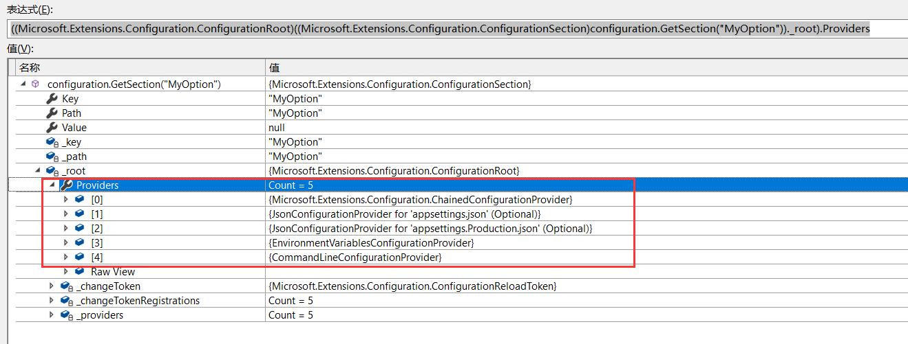


# 参考文档
https://docs.microsoft.com/en-us/dotnet/core/extensions/configuration


# 配置文件三要素

- IConfiguration：提供应用程序使用

- IConfigurationBuilder：IConfiguration的创建者

- IConfigurationSource：其对象实例代表配置数据的来源

  例如：MeoryConfigurationSource

 使用流程，

1. 若干个不同或相同类型的`IConfigurationSource`注册到`IConfigurationBuilder`,
2. `IConfigurationBuilder`创建出`IConfiguration`对象
3. 应用程序使用`IConfiguration`对象访问配置信息


【示例：DotNet.Configuration.Overview1】


MyOption.cs

```C#
    public class MyOption
    {
        public string Option1 { get; set; }
        public string Option2 { get; set; }

        public MyOption(IConfiguration configuration)
        {
            Option1 = configuration["Option1"];
            Option2 = configuration["Option2"];
        }

    }
```

main.cs

```C#
    class Program
    {
        static void Main(string[] args)
        {
            var sourceData = new Dictionary<string, string>
            {
                ["Option1"] = "Option-01",
                ["Option2"] = "Option-02"
            };

            var cfgSource = new MemoryConfigurationSource()
            {
                InitialData = sourceData
            };

            var cfgBuilder = new ConfigurationBuilder();
            cfgBuilder.Add(cfgSource);

            var configration = cfgBuilder.Build();

            var myOption = new MyOption(configration);
            Console.WriteLine($"Option1: {myOption.Option1}");
            Console.WriteLine($"Option2: {myOption.Option2}");

        }

    }
```


# 控制台程序的配置

```C#
using System.Threading.Tasks;
using Microsoft.Extensions.Hosting;

namespace Console.Example
{
    class Program
    {
        static async Task Main(string[] args)
        {
            using IHost host = CreateHostBuilder(args).Build();

            // Application code should start here.

            await host.RunAsync();
        }

        static IHostBuilder CreateHostBuilder(string[] args) =>
            Host.CreateDefaultBuilder(args);
    }
}
```


The [Host.CreateDefaultBuilder(String[\])](https://docs.microsoft.com/en-us/dotnet/api/microsoft.extensions.hosting.host.createdefaultbuilder#Microsoft_Extensions_Hosting_Host_CreateDefaultBuilder_System_String___) method provides default configuration for the app in the following order:

1. [ChainedConfigurationProvider](https://docs.microsoft.com/en-us/dotnet/api/microsoft.extensions.configuration.chainedconfigurationsource) : Adds an existing `IConfiguration` as a source.
2. *appsettings.json* using the [JSON configuration provider](https://docs.microsoft.com/en-us/dotnet/core/extensions/configuration-providers#file-configuration-provider).
3. *appsettings.*`Environment`*.json* using the [JSON configuration provider](https://docs.microsoft.com/en-us/dotnet/core/extensions/configuration-providers#file-configuration-provider). For example, *appsettings*.***Production***.*json* and *appsettings*.***Development***.*json*.
4. App secrets when the app runs in the `Development` environment.
5. Environment variables using the [Environment Variables configuration provider](https://docs.microsoft.com/en-us/dotnet/core/extensions/configuration-providers#environment-variable-configuration-provider).
6. Command-line arguments using the [Command-line configuration provider](https://docs.microsoft.com/en-us/dotnet/core/extensions/configuration-providers#command-line-configuration-provider).




【示例：DotNet.Configuration.Overview2】

```C#
    /// <summary>
    /// https://docs.microsoft.com/en-us/dotnet/core/extensions/configuration
    /// </summary>
    class Program
    {
        static Task Main(string[] args)
        {
            using (IHost host = CreateHostBuilder(args).Build())
            {
                ExemplifyConfiguration(host.Services);

                return host.RunAsync();
            }
        }

        static IHostBuilder CreateHostBuilder(string[] args)
        {
            return Host.CreateDefaultBuilder(args)
                .ConfigureHostConfiguration(configHost =>
                {
                    //configHost.SetBasePath(Directory.GetCurrentDirectory());
                    configHost.AddJsonFile("myoption.json", optional: false); //appsettings.json 存在同名节点，优先取appsettings.json中的配置
                    //configHost.AddEnvironmentVariables(prefix: "PREFIX_");
                    //configHost.AddCommandLine(args);
                });
        }

        static void ExemplifyConfiguration(IServiceProvider services)
        {
            using IServiceScope serviceScope = services.CreateScope();
            IServiceProvider provider = serviceScope.ServiceProvider;

            //依赖注入中获取IConfiguration
            var configuration = provider.GetRequiredService<IConfiguration>();

            //自己创建获取IConfiguration
            //var configuration = new ConfigurationBuilder()
            //    .SetBasePath(Directory.GetCurrentDirectory())
            //    .AddJsonFile("appsettings.json", false)
            //    .Build();

            //---------------------获取配置值的方法--------------------------------
            //GetSection(xxx:x1)
            var myOption1 = configuration.GetSection("MyOption:Option1")?.Value;
            Console.WriteLine($"Option1: {myOption1}");

            //GetSection(xxx)[x1]
            var myOption2 = configuration.GetSection("MyOption")?["Option2"];
            Console.WriteLine($"Option2: {myOption2}");

            //创建对象
            var myOption = configuration.GetSection("MyOption").Get<MyOption>();
            Console.WriteLine($"Option1: {myOption?.Option1}");
            Console.WriteLine($"Option2: {myOption?.Option2}");
        }
    }
```


# Configuration providers

## File configuration provider

[FileConfigurationProvider](https://docs.microsoft.com/en-us/dotnet/api/microsoft.extensions.configuration.fileconfigurationprovider) is the base class for loading configuration from the file system. The following configuration providers derive from `FileConfigurationProvider`:

- [JSON configuration provider](https://docs.microsoft.com/en-us/dotnet/core/extensions/configuration-providers#json-configuration-provider)
- [XML configuration provider](https://docs.microsoft.com/en-us/dotnet/core/extensions/configuration-providers#xml-configuration-provider)
- [INI configuration provider](https://docs.microsoft.com/en-us/dotnet/core/extensions/configuration-providers#ini-configuration-provider)


【示例：DotNet.Configuration.Provider1】

`appsettings.json`:

```C#
{
  "MyOption": {
    "Option1": "Option-01 in appsettings.json",
    "Option2": "Option-02 in appsettings.json"
  }
}

```

`appsettings.xml`:

```C#
<configuration>
  <SecretKey>Secret key value</SecretKey>
  <TransientFaultHandlingOptions>
    <Enabled>true</Enabled>
    <AutoRetryDelay>00:00:07</AutoRetryDelay>
  </TransientFaultHandlingOptions>
  <Logging>
    <LogLevel>
      <Default>Information</Default>
      <Microsoft>Warning</Microsoft>
    </LogLevel>
  </Logging>
</configuration>
```

Program.cs:

```C#
using Microsoft.Extensions.Configuration;
using Microsoft.Extensions.Hosting;
using System;
using System.Threading.Tasks;

namespace DotNet.Configuration.Provider1
{
    class Program
    {

        static async Task Main(string[] args)
        {

            using IHost host = CreateHostBuilder(args).Build();

            // Application code should start here.

            await host.RunAsync();
        }


        static IHostBuilder CreateHostBuilder(string[] args) =>
            Host.CreateDefaultBuilder(args)
                .ConfigureAppConfiguration((hostingContext, configuration) =>
                {
                    configuration.Sources.Clear();

                    IHostEnvironment env = hostingContext.HostingEnvironment;

                    configuration
                        .AddJsonFile("appsettings.json", optional: true, reloadOnChange: true) //using JSON configuration provider
                        .AddJsonFile($"appsettings.{env.EnvironmentName}.json", true, true)
                        .AddXmlFile("appsettings.xml", optional: true, reloadOnChange: true); //using xml provider

                    IConfigurationRoot configurationRoot = configuration.Build();

                    //--------Json Configuration Provider--------
                    var optionsJson = new MyOption();
                    configurationRoot.GetSection(nameof(MyOption))
                                     .Bind(optionsJson);

                    Console.WriteLine("--------Json Configuration Provider--------");
                    Console.WriteLine($"MyOption->Option1: {optionsJson?.Option1}");
                    Console.WriteLine($"MyOption->Option2: {optionsJson?.Option2}");


                    //--------Xml Configuration Provider--------
                    var optionsXml = new TransientFaultHandlingOptions();
                    configurationRoot.GetSection(nameof(TransientFaultHandlingOptions))
                                     .Bind(optionsXml);
                    Console.WriteLine("--------Xml Configuration Provider--------");
                    Console.WriteLine($"TransientFaultHandlingOptions->Option1: {optionsXml?.Enabled}");
                    Console.WriteLine($"TransientFaultHandlingOptions->Option2: {optionsXml?.AutoRetryDelay}");

                });
    }
}

```

输出：

```powershell
--------Json Configuration Provider--------
MyOption->Option1: Option-01 in appsettings.json
MyOption->Option2: Option-02 in appsettings.json
--------Xml Configuration Provider--------
TransientFaultHandlingOptions->Option1: True
TransientFaultHandlingOptions->Option2: 00:00:07
```


### JSON configuration provider

源码：https://github.com/dotnet/runtime/tree/master/src/libraries/Microsoft.Extensions.Configuration.Json/src


## 自定义 configuration provider

文档：https://docs.microsoft.com/en-us/dotnet/core/extensions/custom-configuration-provider


[示例：DotNet.Configuration.CustomProvider]

跟踪源码分析：

```C#
configuration.AddEntityConfiguration(
                    options => options.UseInMemoryDatabase("InMemoryDb")); //EF Core 内存数据库
    public static IConfigurationBuilder AddEntityConfiguration(this IConfigurationBuilder builder,
        Action<DbContextOptionsBuilder> optionsAction)
    {
        return builder.Add(new EntityConfigurationSource(optionsAction));
    }
```

-->

**builder.Add(new EntityConfigurationSource(optionsAction));**

```C#
    public class ConfigurationBuilder : IConfigurationBuilder
    {
        /// <summary>
        /// Returns the sources used to obtain configuration values.
        /// </summary>
        public IList<IConfigurationSource> Sources { get; } = new List<IConfigurationSource>();
        
        public IConfigurationBuilder Add(IConfigurationSource source)
        {
            if (source == null)
            {
                throw new ArgumentNullException(nameof(source));
            }

            Sources.Add(source);
            return this;
        }
    }
```

-->

**IConfigurationRoot configurationRoot = configuration.Build();**

```C#
        public IConfigurationRoot Build()
        {
            var providers = new List<IConfigurationProvider>();
            foreach (IConfigurationSource source in Sources)
            {
                IConfigurationProvider provider = source.Build(this);
                providers.Add(provider);
            }
            return new ConfigurationRoot(providers);
        }
```

-->source.Build(this);

-->**EntityConfigurationSource.Build(IConfigurationBuilder builder)**

```C#
    public class EntityConfigurationSource : IConfigurationSource
    {
        private readonly Action<DbContextOptionsBuilder> _optionsAction;
        ....
            
        #region IConfigurationSource 成员
        public IConfigurationProvider Build(IConfigurationBuilder builder)
        {
            return new EntityConfigurationProvider(_optionsAction);
        } 
        #endregion
    }
```


-->**return new ConfigurationRoot(providers)**

```C#
    /// <summary>
    /// The root node for a configuration.
    /// </summary>
    public class ConfigurationRoot : IConfigurationRoot, IDisposable
    {
        private readonly IList<IConfigurationProvider> _providers;

        /// <summary>
        /// Initializes a Configuration root with a list of providers.
        /// </summary>
        /// <param name="providers">The <see cref="IConfigurationProvider"/>s for this configuration.</param>
        public ConfigurationRoot(IList<IConfigurationProvider> providers)
        {
            if (providers == null)
            {
                throw new ArgumentNullException(nameof(providers));
            }
            _providers = providers;
            _changeTokenRegistrations = new List<IDisposable>(providers.Count);
            foreach (IConfigurationProvider p in providers)
            {
                p.Load();
               _changeTokenRegistrations.Add(ChangeToken.OnChange(() => p.GetReloadToken(), () => RaiseChanged())); //如果有变化重新加载
            }
        }
```

-->p.Load();-->**EntityConfigurationProvider.Load()**

```C#
        /// <summary>
        /// Loads (or reloads) the data for this provider.
        /// </summary>
        public override void Load()
        {
            var builder = new DbContextOptionsBuilder<EntityConfigurationContext>();

            _optionsAction(builder);

            //创建一个内存数据
            using var dbContext = new EntityConfigurationContext(builder.Options);
            dbContext.Database.EnsureCreated();

            //ConfigurationProvider的数据源
            this.Data = dbContext.Settings.Any()
                ? dbContext.Settings.ToDictionary(c => c.Id, c => c.Value)
                : CreateAndSaveDefaultValues(dbContext);
        }
```


- 获取值的方式：

-->   **var myOption1 = configurationRoot.GetSection("EndpointId")?.Value;**

-->configurationRoot.GetSection

```C#
public IConfigurationSection GetSection(string key)
        => new ConfigurationSection(this, key);
```
ConfigurationSection .Value

```C#
public class ConfigurationSection : IConfigurationSection
{
        public ConfigurationSection(IConfigurationRoot root, string path)
        {
            if (root == null)
            {
                throw new ArgumentNullException(nameof(root));
            }

            if (path == null)
            {
                throw new ArgumentNullException(nameof(path));
            }

            _root = root;
            _path = path;
        }
    

        /// <summary>
        /// Gets or sets the section value.
        /// </summary>
        public string Value
        {
            get
            {
                return _root[Path];
            }
            set
            {
                _root[Path] = value;
            }
        }
}
```


​      **var myOption2 = configurationRoot["DisplayLabel"];**

```C#
    public class ConfigurationRoot : IConfigurationRoot, IDisposable
    {    
        public string this[string key]
        {
            get
            {
                for (int i = _providers.Count - 1; i >= 0; i--)
                {
                    IConfigurationProvider provider = _providers[i];

                    if (provider.TryGet(key, out string value))
                    {
                        return value;
                    }
                }

                return null;
            }
            set
            {
                if (!_providers.Any())
                {
                    throw new InvalidOperationException(SR.Error_NoSources);
                }

                foreach (IConfigurationProvider provider in _providers)
                {
                    provider.Set(key, value);
                }
            }
        }
```


## Options interfaces

[IOptions](https://docs.microsoft.com/en-us/dotnet/api/microsoft.extensions.options.ioptions-1):

- Does**not**support:
  - Reading of configuration data after the app has started.
  - [Named options](https://docs.microsoft.com/zh-cn/dotnet/core/extensions/options#named-options-support-using-iconfigurenamedoptions)
- Is registered as a [Singleton](https://docs.microsoft.com/zh-cn/dotnet/core/extensions/dependency-injection#singleton) and can be injected into any [service lifetime](https://docs.microsoft.com/zh-cn/dotnet/core/extensions/dependency-injection#service-lifetimes).

[IOptionsSnapshot](https://docs.microsoft.com/en-us/dotnet/api/microsoft.extensions.options.ioptionssnapshot-1):

- Is useful in scenarios where options should be recomputed on every injection resolution, in [scoped or transient lifetimes](https://docs.microsoft.com/zh-cn/dotnet/core/extensions/dependency-injection#service-lifetimes). For more information, see [Use IOptionsSnapshot to read updated data](https://docs.microsoft.com/zh-cn/dotnet/core/extensions/options#use-ioptionssnapshot-to-read-updated-data).
- Is registered as [Scoped](https://docs.microsoft.com/zh-cn/dotnet/core/extensions/dependency-injection#scoped) and therefore cannot be injected into a Singleton service.
- Supports [named options](https://docs.microsoft.com/zh-cn/dotnet/core/extensions/options#named-options-support-using-iconfigurenamedoptions)

[IOptionsMonitor](https://docs.microsoft.com/en-us/dotnet/api/microsoft.extensions.options.ioptionsmonitor-1):

- Is used to retrieve options and manage options notifications for `TOptions` instances.
- Is registered as a [Singleton](https://docs.microsoft.com/zh-cn/dotnet/core/extensions/dependency-injection#singleton) and can be injected into any [service lifetime](https://docs.microsoft.com/zh-cn/dotnet/core/extensions/dependency-injection#service-lifetimes).
- Supports:
  - Change notifications
  - [Named options](https://docs.microsoft.com/zh-cn/dotnet/core/extensions/options#named-options-support-using-iconfigurenamedoptions)
  - [Reloadable configuration](https://docs.microsoft.com/zh-cn/dotnet/core/extensions/options#use-ioptionssnapshot-to-read-updated-data)
  - Selective options invalidation ([IOptionsMonitorCache](https://docs.microsoft.com/en-us/dotnet/api/microsoft.extensions.options.ioptionsmonitorcache-1))


【示例：3-1.DotNet.Configuration.OptionsPattern】

添加`appsetting.json`配置文件

```json
{
  "MyOption": {
    "Option1": "Option-01",
    "Option2": "Option-02"
  }
}

```

MyOption.cs

```C#
namespace DotNet.Configuration.OptionsPattern
{
    public class MyOption
    {
        public string Id { get; set; } 
        public string Option1 { get; set; }
        public string Option2 { get; set; }

        public MyOption()
        {
            Id = Guid.NewGuid().ToString()[^4..];
        }

    }
}
```


Program.cs

```C#
using Microsoft.Extensions.Configuration;
using Microsoft.Extensions.DependencyInjection;
using Microsoft.Extensions.Hosting;
using System;

namespace DotNet.Configuration.OptionsPattern
{
    class Program
    {
        static void Main(string[] args)
        {
            IHost host = CreateHostBuilder(args).Build();

            using IServiceScope serviceScope = host.Services.CreateScope();
            IServiceProvider provider = serviceScope.ServiceProvider;
            //host.Services.C


            host.Run();
        }

        static IHostBuilder CreateHostBuilder(string[] args)
        {
            return Host.CreateDefaultBuilder(args)
                .ConfigureServices(services =>
                {
                    services.AddTransient<ExampleService>();
                    services.AddTransient<ScopedService>();
                    services.AddTransient<MonitorService>();

                    services.AddHostedService<Worker>();
                    
                    #region 转移到Configure方法中
                    //IServiceProvider serviceProvider = services.BuildServiceProvider();
                    //var configuration = serviceProvider.GetRequiredService<IConfiguration>();

                    //var myoption = configuration.GetSection(nameof(MyOption)).Get<MyOption>();
                    //Console.WriteLine($"ConfigureService-->MyOption:{Newtonsoft.Json.JsonConvert.SerializeObject(myoption)}");


                    ////依赖注入
                    //services.Configure<MyOption>(configuration.GetSection(nameof(MyOption))); 
                    #endregion
                    services.AddOptions() //注册了Options模式的核心服务
                            .Configure<MyOption>(context.Configuration.GetSection(nameof(MyOption)));
                });
        }
    }
}

```

- 将`MyOption`依赖注入到DI容器中

  ```C#
  services.Configure<MyOption>(configuration.GetSection(nameof(MyOption)));
  ```

  

Woker.cs

```C#
public class Worker : BackgroundService
    {
        private readonly ExampleService _exampleService;
        private readonly ScopedService _scopedService;
        private readonly MonitorService _monitorService;

        public Worker(ExampleService exampleService,
            ScopedService scopedService,
            MonitorService monitorService)
        {
            _exampleService = exampleService;
            _scopedService = scopedService;
            _monitorService = monitorService;
        }

        protected override async Task ExecuteAsync(CancellationToken stoppingToken)
        {
            while (!stoppingToken.IsCancellationRequested)
            {
                Console.WriteLine($"\n\r--------------at { DateTime.UtcNow}--------------");

                _exampleService.DisplayValues();
                _scopedService.DisplayValues();
                _monitorService.DisplayValues();

                await Task.Delay(10 * 1000, stoppingToken);
            }
        }
    }
```

ExampleService.cs

```C#
using Microsoft.Extensions.DependencyInjection;
using Microsoft.Extensions.Options;
using System;

namespace DotNet.Configuration.OptionsPattern
{
    public class ExampleService
    {
        public string Id { get; set; }
        private readonly IServiceProvider _serviceProvider;

        public ExampleService(IServiceProvider serviceProvider)
        {
            Id = Guid.NewGuid().ToString()[^4..];
            _serviceProvider = serviceProvider;
        }

        public void DisplayValues()
        {
            using (var scope = _serviceProvider.CreateScope())
            {
                var option = scope.ServiceProvider.GetRequiredService<IOptions<MyOption>>().Value;
                Console.WriteLine($"{Id}.{nameof(ExampleService)}.IOptions<MyOption>: {Newtonsoft.Json.JsonConvert.SerializeObject(option)}");
                
                var optionsSnapshot = scope.ServiceProvider.GetRequiredService<IOptionsSnapshot<MyOption>>().Value;
                Console.WriteLine($"{Id}.{nameof(ExampleService)}.IOptionsSnapshot<MyOption>-1: {Newtonsoft.Json.JsonConvert.SerializeObject(optionsSnapshot)}");
                var optionsSnapshot2 = scope.ServiceProvider.GetRequiredService<IOptionsSnapshot<MyOption>>().Value;
                Console.WriteLine($"{Id}.{nameof(ExampleService)}.IOptionsSnapshot<MyOption>-2: {Newtonsoft.Json.JsonConvert.SerializeObject(optionsSnapshot2)}");

                var optionsMonitor = scope.ServiceProvider.GetRequiredService<IOptionsMonitor<MyOption>>().CurrentValue;
                Console.WriteLine($"{Id}.{nameof(ExampleService)}.IOptionsMonitor<MyOption>: {Newtonsoft.Json.JsonConvert.SerializeObject(optionsMonitor)}");

                Console.WriteLine();

            }
        }

    }

}

```


ScopedService.cs

```C#
    public class ScopedService
    {
        public string Id { get; set; }
        private readonly IServiceProvider _serviceProvider;

        public ScopedService(IServiceProvider serviceProvider)
        {
            Id = Guid.NewGuid().ToString()[^4..];
            _serviceProvider = serviceProvider;
        }

        public void DisplayValues()
        {
            using (var scope = _serviceProvider.CreateScope())
            {
                var optionsSnapshot = scope.ServiceProvider.GetRequiredService<IOptionsSnapshot<MyOption>>().Value;
                Console.WriteLine($"{Id}.{nameof(ScopedService)}.IOptionsSnapshot<MyOption>: {Newtonsoft.Json.JsonConvert.SerializeObject(optionsSnapshot)}");
            }
        }

    }
```


MonitorService.cs

```C#
public class MonitorService
{
    public string Id { get; set; }
    private readonly IServiceProvider _serviceProvider;

    public MonitorService(IServiceProvider serviceProvider)
    {
        Id = Guid.NewGuid().ToString()[^4..];
        _serviceProvider = serviceProvider;
    }

    public void DisplayValues()
    {
        using (var scope = _serviceProvider.CreateScope())
        {
            var optionsMonitor = scope.ServiceProvider.GetRequiredService<IOptionsMonitor<MyOption>>().CurrentValue;
            Console.WriteLine($"{Id}.{nameof(MonitorService)}.IOptionsMonitor<MyOption>: {Newtonsoft.Json.JsonConvert.SerializeObject(optionsMonitor)}");
        }
    }

}
```


运行控制台项目，输出：

```powershell
--------------at 2020/12/14 14:47:10--------------
7c05.ExampleService.IOptions<MyOption>: {"Id":"66a2","Option1":"Option-01","Option2":"Option-02"}
7c05.ExampleService.IOptionsSnapshot<MyOption>-1: {"Id":"acd2","Option1":"Option-01","Option2":"Option-02"}
7c05.ExampleService.IOptionsSnapshot<MyOption>-2: {"Id":"acd2","Option1":"Option-01","Option2":"Option-02"}
7c05.ExampleService.IOptionsMonitor<MyOption>: {"Id":"c5f4","Option1":"Option-01","Option2":"Option-02"}

7f2e.ScopedService.IOptionsSnapshot<MyOption>: {"Id":"838a","Option1":"Option-01","Option2":"Option-02"}
a0eb.MonitorService.IOptionsMonitor<MyOption>: {"Id":"c5f4","Option1":"Option-01","Option2":"Option-02"}

--------------at 2020/12/14 14:47:15--------------
7c05.ExampleService.IOptions<MyOption>: {"Id":"66a2","Option1":"Option-01","Option2":"Option-02"}
7c05.ExampleService.IOptionsSnapshot<MyOption>-1: {"Id":"7cd5","Option1":"Option-01","Option2":"Option-02"}
7c05.ExampleService.IOptionsSnapshot<MyOption>-2: {"Id":"7cd5","Option1":"Option-01","Option2":"Option-02"}
7c05.ExampleService.IOptionsMonitor<MyOption>: {"Id":"c5f4","Option1":"Option-01","Option2":"Option-02"}

7f2e.ScopedService.IOptionsSnapshot<MyOption>: {"Id":"86b2","Option1":"Option-01","Option2":"Option-02"}
a0eb.MonitorService.IOptionsMonitor<MyOption>: {"Id":"c5f4","Option1":"Option-01","Option2":"Option-02"}

--------------at 2020/12/14 14:47:20--------------
7c05.ExampleService.IOptions<MyOption>: {"Id":"66a2","Option1":"Option-01","Option2":"Option-02"}
7c05.ExampleService.IOptionsSnapshot<MyOption>-1: {"Id":"744e","Option1":"Option-01","Option2":"Option-02"}
7c05.ExampleService.IOptionsSnapshot<MyOption>-2: {"Id":"744e","Option1":"Option-01","Option2":"Option-02"}
7c05.ExampleService.IOptionsMonitor<MyOption>: {"Id":"c5f4","Option1":"Option-01","Option2":"Option-02"}

7f2e.ScopedService.IOptionsSnapshot<MyOption>: {"Id":"664a","Option1":"Option-01","Option2":"Option-02"}
a0eb.MonitorService.IOptionsMonitor<MyOption>: {"Id":"c5f4","Option1":"Option-01","Option2":"Option-02"}

//.....
//修改bin文件夹下`appsetting.json`配置文件中的"Option1"为 "Option-012",

--------------at 2020/12/14 14:48:38--------------
7c05.ExampleService.IOptions<MyOption>: {"Id":"66a2","Option1":"Option-01","Option2":"Option-02"}
7c05.ExampleService.IOptionsSnapshot<MyOption>-1: {"Id":"7de7","Option1":"Option-012","Option2":"Option-02"}
7c05.ExampleService.IOptionsSnapshot<MyOption>-2: {"Id":"7de7","Option1":"Option-012","Option2":"Option-02"}
7c05.ExampleService.IOptionsMonitor<MyOption>: {"Id":"ad5c","Option1":"Option-012","Option2":"Option-02"}

7f2e.ScopedService.IOptionsSnapshot<MyOption>: {"Id":"2270","Option1":"Option-012","Option2":"Option-02"}
a0eb.MonitorService.IOptionsMonitor<MyOption>: {"Id":"ad5c","Option1":"Option-012","Option2":"Option-02"}

--------------at 2020/12/14 14:48:43--------------
7c05.ExampleService.IOptions<MyOption>: {"Id":"66a2","Option1":"Option-01","Option2":"Option-02"}
7c05.ExampleService.IOptionsSnapshot<MyOption>-1: {"Id":"b251","Option1":"Option-012","Option2":"Option-02"}
7c05.ExampleService.IOptionsSnapshot<MyOption>-2: {"Id":"b251","Option1":"Option-012","Option2":"Option-02"}
7c05.ExampleService.IOptionsMonitor<MyOption>: {"Id":"ad5c","Option1":"Option-012","Option2":"Option-02"}

7f2e.ScopedService.IOptionsSnapshot<MyOption>: {"Id":"f1e4","Option1":"Option-012","Option2":"Option-02"}
a0eb.MonitorService.IOptionsMonitor<MyOption>: {"Id":"ad5c","Option1":"Option-012","Option2":"Option-02"}

--------------at 2020/12/14 14:48:48--------------
7c05.ExampleService.IOptions<MyOption>: {"Id":"66a2","Option1":"Option-01","Option2":"Option-02"}
7c05.ExampleService.IOptionsSnapshot<MyOption>-1: {"Id":"c4be","Option1":"Option-012","Option2":"Option-02"}
7c05.ExampleService.IOptionsSnapshot<MyOption>-2: {"Id":"c4be","Option1":"Option-012","Option2":"Option-02"}
7c05.ExampleService.IOptionsMonitor<MyOption>: {"Id":"ad5c","Option1":"Option-012","Option2":"Option-02"}

7f2e.ScopedService.IOptionsSnapshot<MyOption>: {"Id":"762b","Option1":"Option-012","Option2":"Option-02"}
a0eb.MonitorService.IOptionsMonitor<MyOption>: {"Id":"ad5c","Option1":"Option-012","Option2":"Option-02"}


//.....

```

结论：

  - IOptions<MyOption>：为单例，不可跟踪变化，应用程序启动后无法改变，整个应用程序就一个`MyOption`单例
  - IOptionsSnapshot<MyOption>：为Scoped，可跟踪变化，每次请求（同作用域内）创建一个新的`MyOption`对象
  - IOptionsMonitor<MyOption>:为单例，可跟踪变化，配置文件每改变一次，创建一个新的`MyOption`单例


